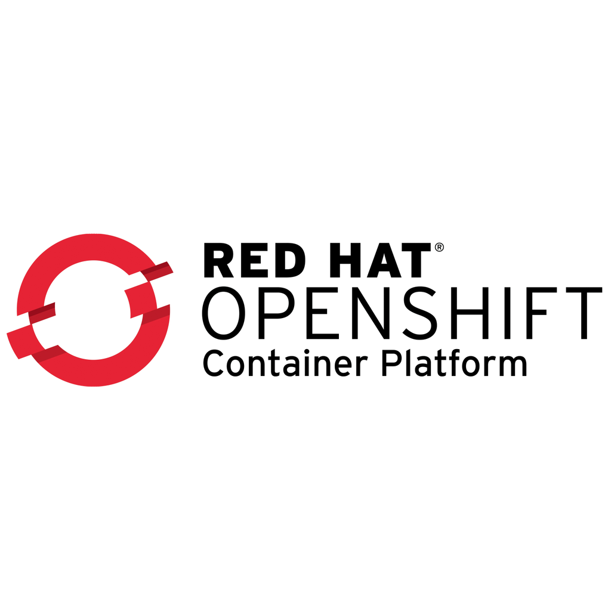

## Enterprise Solutions like OpenShift

Kubernetes as an open-source solution is great. However, there are now a variety of different enterprise solutions on the market that aim to make the life of cluster administrators easier. These enterprise solutions, equipped with a nice UI, customer support, and other pleasant amenities, come at a price. For demo purposes, some providers offer free demo environments for limited periods. In the third hands-on lab, we will deploy an e-commerce microservices application on a demo OpenShift cluster from Red Hat. 

> Enjoy the third and for now, the last hands-on lab!