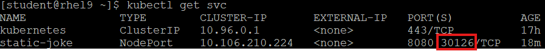

#### Deploy the Image Locally Using Minikube

1. Start Minikube:

    ```bash
    minikube start
    ```

2. Load the image into Minikube and make sure that is correctly loaded:

    ```bash
    minikube image load <YOURNAME_image-name>:<tag>

    minikube ssh -- docker images
    ```

3. Deploy the image as single pod on Minikube:

    ```bash
    kubectl run <pod-name> --image=<YOURNAME_image-name>:<tag> --port 8080
    ```

4. At this point, we have two ways to access the webpage (a and b):

    1. We can create a service with type **"ClusterIP"**:

        ```bash
        kubectl expose pod <pod-name> --type=ClusterIP --port=8080 --name <service-name>
        ```

        and then use minikube native load balancer to open a tunnel to the serice:

        ```bash
        minikube service <service-name>
        ```

    2. The second method uses the service type **"NodePort"**:

        ```bash
        kubectl expose pod <pod-name> --type=NodePort --port=8080 --name <service-name>
        ```

        and the ip address of the minikube's node, which can be obtained from this command:

        ```bash
        minikube node list
        ```

        to access the webpage. For that we need the **"nodePort"** assigned to the service we just created:

        ```bash
        kubectl get service
        ```

        as shown in this image, look for a port number that starts with ***30...***:

        
        
        In the browser go the *URL* that is built from *minikube-node-ip* and *nodeport* to see the webpage:

        ```bash
        URL = http://<minikube-node-ip>:<nodeport>
        ```
        
> Replace placeholders with your actual values as needed