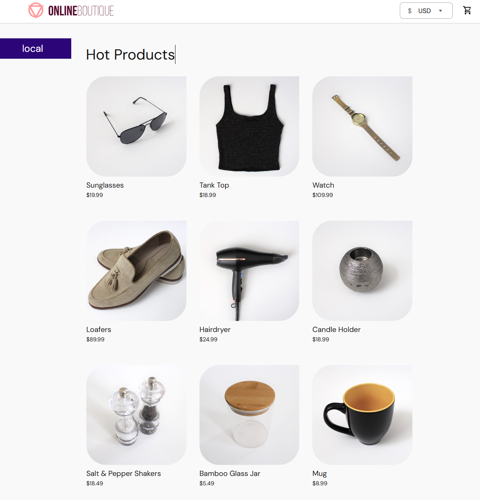
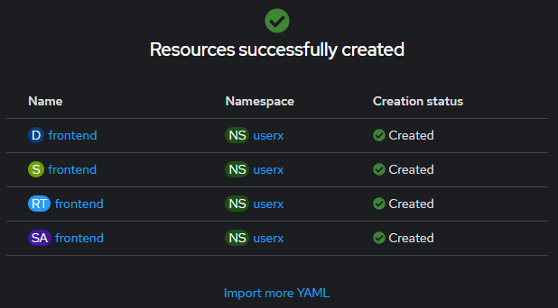

## Hands-On Labs

In this Hands-On-Labs, we deploy an *e-commerce application*, which is based on the [Online Boutique](https://github.com/GoogleCloudPlatform/microservices-demo), provided by [Google Cloud Platform](https://github.com/GoogleCloudPlatform). 
The deployment manifests are modified so that they could be deployed on an OpenShift Cluster. The User Interface of **"Online Boutique"** looks like this image:


### Architecture
On the main page of the Online Boutique, a frontend service forwards the requests to the 10 corresponding backend services, as shown in this architectur image: 


All these 11 microservices are communicating over gRPC protocol. 

### Microservices

These 11 microservices are written in different programming languages and are responsible for a specific task in this e-commerce website:


| Service                                              | Language      | Description                                                                                                                       |
| ---------------------------------------------------- | ------------- | --------------------------------------------------------------------------------------------------------------------------------- |
| frontend                        | Go            | Exposes an HTTP server to serve the website. Does not require signup/login and generates session IDs for all users automatically. |
| cartservice                     | C#            | Stores the items in the user's shopping cart in Redis and retrieves it.                                                           |
| productcatalogservice           | Go            | Provides the list of products from a JSON file and ability to search products and get individual products.                        |
| currencyservice                 | Node.js       | Converts one money amount to another currency. Uses real values fetched from European Central Bank. It's the highest QPS service. |
| paymentservice                  | Node.js       | Charges the given credit card info (mock) with the given amount and returns a transaction ID.                                     |
| shippingservice                 | Go            | Gives shipping cost estimates based on the shopping cart. Ships items to the given address (mock)                                 |
| emailservice                    | Python        | Sends users an order confirmation email (mock).                                                                                   |
| checkoutservice                 | Go            | Retrieves user cart, prepares order and orchestrates the payment, shipping and the email notification.                            |
| recommendationservice           | Python        | Recommends other products based on what's given in the cart.                                                                      |
| adservice                       | Java          | Provides text ads based on given context words.                                                                                   |
| loadgenerator                   | Python/Locust | Continuously sends requests imitating realistic user shopping flows to the frontend.         


### Prerequisites

Ensure that you have access to a **OpenShift Cluster** to deploy the manifests for the e-commerce application. If you do not already have access to a Demo Cluster, ask your training instructor!


### Tutorial Instructions

We will deploy step by step the manifests in this directory from the OpenShift Console.

Login to OpenShift cluster using the provided credentials, create a new ***project*** and set the project's name as your provided user (for example *"userX"*): 


#### Frontend Deployment

Now, we will add *frontend* resources by going to the ***+Add*** page:


and import the corresponding yaml files, that we cloned from the repository earlier, in ***Import YAML***:


In ***Import YAML***, make sure that you are in the right project (i.e. **userx**) and then click on ***Create***:


After some seconds or minutes, it shows that the resources for *frontend* service are successfully deployed:



Now, we go to ***Topology*** page and click on the arrow at the top right corner to open up the web application in a browser:


Wait a moment! We did everything correct but still there is an *Error* and the website is not properly loaded:


That is because *frontend* is only the shell of this microservice application and all the backend services are not deployed yet! 

#### Deploy Backend Services
At this stage, we will follow the steps described before to add resources for these backend services
- adservice.yaml
- cartservice
- checkoutservice.yaml
- currencyservice.yaml
- loadgenerator.yaml
- productionservice.yaml
- recommendationservice.yaml
- shippingservice.yaml

by importing *YAML* files from the cloned repo into the same *project* (i.e. **userx**) on the cluster and wait some minutes for them to be successfully deployed.

YUHU! All part of the puzzle are in running state! **But someting is not right!**
Why are the *recommendations* and *Advertisement* not shown!

***Please compare the website with the link you recieve during the workshop!***

***Tipp: Look into the ports configured in the frontend deployment!***

After troubleshooting and connecting properly the *recommendations* and *Advertisement* services, we go further with add two more services to the application: *payment* & *email*

#### Deploy Services *Payment* and *Email* from Terminal

In order to open up a terminal, click on the *"icon"* at top right corner of the console, as shown in the image:


Then start a terminal in the window that pops up at the bottom of the page:


That should start a workspace pod in your project and provide you with a shell. 

First, we clone the repository[kubernetes-training](https://github.com/anairo98/kubernetes-training.git):


Go to the *"kubernetes-training/e-commerce"* directory and run below commands:

1. deploy *email* service:

   ```bash
   kubectl apply -f emailservice.yaml
   ```

2. Deploy *payment* service: 

   ```bash
   kubectl apply -f paymentservice.yaml
   ```


> Now, it is time to make some money from our website! 
:smile: :money_with_wings: