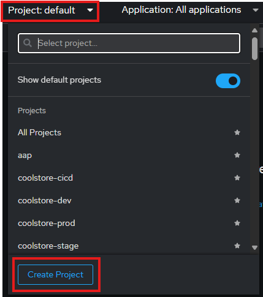
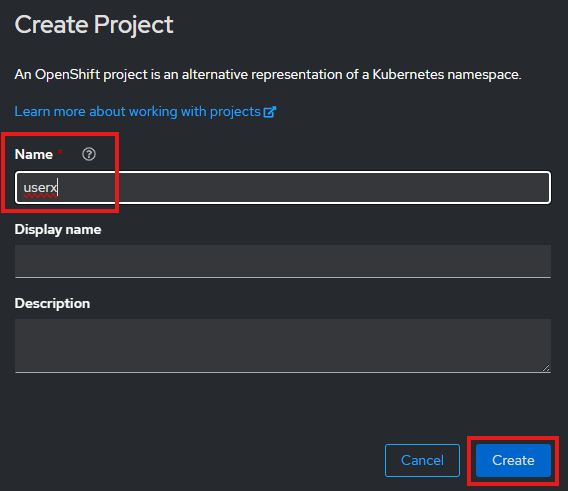

## Hands-On Labs
In this Hands-On-Labs, we deploy an *e-commerce application*, which is based on the [Online Boutique](https://github.com/GoogleCloudPlatform/microservices-demo), provided by [Google Cloud Platform](https://github.com/GoogleCloudPlatform). The deployment manifests are modified so that they could be deployed on an OpenShift Cluster. The interface of **"Online Boutique"** looks like this image:
[](/img/boutique_interface.png)

### Architecture
On the main page of the Online Boutique, a frontend service forwards the requests to the 10 corresponding backend services, as shown in this architectur image: 

[](/img/architecture-diagram.png)

All these 11 microservices are communicating over gRPC protocol. 

### Microservices
These 11 microservices are written in different programming languages and are responsible for a specific task in this e-commerce website:


| Service                                              | Language      | Description                                                                                                                       |
| ---------------------------------------------------- | ------------- | --------------------------------------------------------------------------------------------------------------------------------- |
| frontend                        | Go            | Exposes an HTTP server to serve the website. Does not require signup/login and generates session IDs for all users automatically. |
| cartservice                     | C#            | Stores the items in the user's shopping cart in Redis and retrieves it.                                                           |
| productcatalogservice           | Go            | Provides the list of products from a JSON file and ability to search products and get individual products.                        |
| currencyservice                 | Node.js       | Converts one money amount to another currency. Uses real values fetched from European Central Bank. It's the highest QPS service. |
| paymentservice                  | Node.js       | Charges the given credit card info (mock) with the given amount and returns a transaction ID.                                     |
| shippingservice                 | Go            | Gives shipping cost estimates based on the shopping cart. Ships items to the given address (mock)                                 |
| emailservice                    | Python        | Sends users an order confirmation email (mock).                                                                                   |
| checkoutservice                 | Go            | Retrieves user cart, prepares order and orchestrates the payment, shipping and the email notification.                            |
| recommendationservice           | Python        | Recommends other products based on what's given in the cart.                                                                      |
| adservice                       | Java          | Provides text ads based on given context words.                                                                                   |
| loadgenerator                   | Python/Locust | Continuously sends requests imitating realistic user shopping flows to the frontend.         

<!-- ### Directory Structure

The `e-commerce` directory contains the following files and subdirectories:

```
e-commerce/
├── adservice.yaml
    
``` -->

### Prerequisites
Ensure that you have access to a **OpenShift Cluster** to deploy the manifests for the e-commerce application.


### Tutorial Instructions
We will deploy step by step the manifests in this directory from the OpenShift Console.

Login to OpenShift using provided user and Password:


and create a new ***project*** with your provided user: 

<a href="../img/ocp_create_project_1.png">
  
</a>         


<a href="../img/ocp_create_project_2.png">
  
</a>

<!-- [](/img/ocp_create_project_1.png)
[](/img/ocp_create_project_2.png) -->


Go to

1. First deploy *frontend*, 
   ```bash
   kubectl apply -f frontend.yaml
   ```